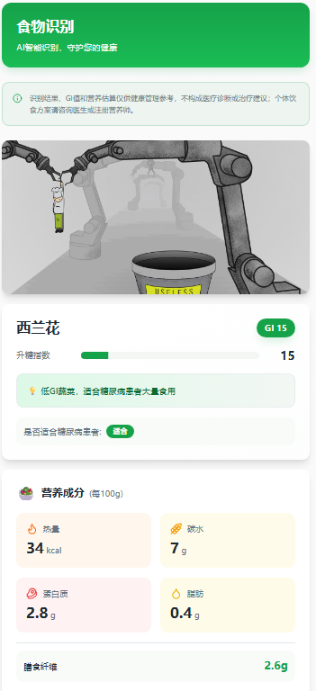

# 食物血糖指数指南 (Food Glucemic Guide)

基于AI的食物识别和血糖指数分析应用，帮助糖尿病患者和关注健康的人群科学管理饮食。



## 功能特性

- 🍽️ **AI食物识别**: 使用通义千问视觉模型智能识别食物
- 📊 **血糖指数分析**: 提供准确的GI值和分类
- 🥗 **营养成分估算**: 详细的热量、碳水、蛋白质等营养信息
- 💡 **个性化建议**: 针对糖尿病患者的饮食建议
- 📱 **响应式设计**: 支持手机、平板等设备
- 🌏 **中文优化**: 专门针对中式食物识别优化

## 技术栈

### 前端

- Vite + TypeScript
- React 18
- Tailwind CSS
- shadcn/ui
- React Router

### 后端

- Express.js
- OpenAI SDK
- 通义千问 VL-Plus 模型
- CORS 跨域支持

## 快速开始

### 🚀 一键启动 (推荐)

Windows用户可以直接运行启动脚本：

```bash
# 双击运行或在命令行执行
start.bat
```

**启动脚本功能：**

- ✅ 自动检查Node.js环境
- ✅ 智能安装项目依赖
- ✅ 交互式菜单选择启动模式
- ✅ 一键停止所有服务

**其他脚本：**

```bash
stop.bat    # 快速停止所有服务
```

**脚本使用说明：**

1. **start.bat** - 主启动脚本，提供完整功能
2. **stop.bat** - 快速停止脚本，用于紧急停止服务

### 📋 环境要求

- Node.js >= 16.0.0
- npm >= 7.0.0
- 通义千问 API Key (仅真实AI模式需要)

### 🔧 手动安装步骤

1. **克隆项目**

```bash
git clone <YOUR_GIT_URL>
cd food-glucemic-guide-main
```

2. **安装依赖**

```bash
npm install
```

3. **配置API密钥 (可选)**
   创建 `.env` 文件并配置：

```bash
DASHSCOPE_API_KEY=your-api-key-here
DASHSCOPE_BASEURL=https://dashscope.aliyuncs.com/compatible-mode/v1
```

4. **选择启动模式**

**🧪 模拟服务器 (推荐用于测试)**

```bash
npm run server:mock
```

- ✅ 无需API密钥
- ✅ 响应速度快
- ✅ 返回预设食物数据

**🤖 真实AI服务器**

```bash
npm run server:ai
```

- 🔑 需要配置通义千问API密钥
- 📸 提供真实食物识别
- 🥗 准确的营养分析

5. **启动前端服务**

```bash
npm run dev
```

6. **访问应用**

- 🌐 前端: http://localhost:5173
- 🔧 后端API: http://localhost:3001
- ❤️ 健康检查: http://localhost:3001/api/health

### 📱 使用流程

1. **启动服务** → 选择模拟或真实AI模式
2. **打开前端** → 访问 http://localhost:5173
3. **食物识别** → 拍照或上传食物图片
4. **查看结果** → 获取GI值和营养建议

## API接口

### 食物分析接口

```
POST /api/analyze-food
Content-Type: application/json

{
  "image": "data:image/jpeg;base64,/9j/4AAQSkZJRgABAQAAAQ..."
}
```

**响应格式:**

```json
{
  "success": true,
  "data": {
    "food_name": "红烧肉",
    "gi_value": 75,
    "suitable_for_diabetics": false,
    "recommendation": "建议适量搭配蔬菜食用，控制份量",
    "estimated_nutrition": {
      "calories": 320,
      "carbs": 12,
      "protein": 18,
      "fat": 24,
      "fiber": 0.5
    }
  }
}
```

## 项目结构

```
food-glucemic-guide-main/
├── src/                    # 前端源码
│   ├── components/        # UI组件
│   ├── pages/            # 页面组件
│   ├── data/             # 数据文件
│   └── hooks/            # 自定义Hook
├── resource/             # 项目资料和示例数据
│   └── foods.json        # 食物数据库示例
├── docs/                 # 第三方API集成说明
├── server.js             # 后端服务器
├── .env.example          # 环境变量模板
└── package.json          # 项目配置
```

## 使用说明

### 1. 食物库浏览

- 在食物库页面可以查看各种食物的GI值
- 支持按GI等级筛选 (低/中/高)
- 显示详细的营养成分信息

### 2. AI食物识别

- 拍照或从相册选择食物图片
- AI自动识别食物种类和营养成分
- 提供针对糖尿病患者的饮食建议

### 3. 血糖记录

- 记录每日血糖数据
- 生成可视化图表
- 追踪血糖变化趋势

## 注意事项

### API密钥安全

- 请勿将API密钥提交到版本控制系统
- 建议使用环境变量管理敏感信息
- 生产环境请使用安全的密钥管理方案

### 图片上传限制

- 支持常见图片格式 (JPEG, PNG, WebP)
- 图片大小建议不超过10MB
- Base64编码会增大约33%的体积

### 医疗与隐私说明

- 本项目提供的GI值、营养估算和AI识别结果仅供健康管理参考，不构成医疗诊断、治疗或处方建议。
- 用户上传图片会发送到本地后端，并在真实AI模式下转发给配置的DashScope/Qwen接口处理。
- 血糖记录默认保存在浏览器本地存储中；更多说明见 [PRIVACY.md](./PRIVACY.md)。

### 开源合规说明

- 项目代码采用 MIT 许可证，见 [LICENSE](./LICENSE)。
- 第三方依赖以 `package.json` 和锁文件为准，发布前可运行 `pnpm licenses list --prod` 复核。
- 仓库不再包含无法确认授权来源的食物图片，食物库界面使用文本/emoji 和原创SVG图标。
- 第三方API文档仅保留项目集成说明，完整参数请查看供应商官方文档。

## 开发指南

### 启动开发环境

```bash
# 同时启动前后端服务 (需要两个终端)
npm run server:dev  # 终端1: 启动后端
npm run dev         # 终端2: 启动前端
```

### 构建生产版本

```bash
# 构建前端
npm run build

# 预览构建结果
npm run preview
```

## 获取API密钥

1. 访问 [阿里云DashScope控制台](https://dashscope.console.aliyun.com/)
2. 注册/登录阿里云账号
3. 开通通义千问服务
4. 创建API Key
5. 将API Key配置到环境变量中

## 🔧 故障排除

### ❌ 常见问题

1. **"Failed to fetch" 错误**

   - 🛠️ **解决方法**: 运行 `start.bat` 选择启动模拟服务器
   - 🔍 **原因**: 后端服务器未启动或端口被占用
   - ✅ **检查**: 访问 http://localhost:3001/api/health
2. **AI返回数据格式错误**

   - 🖼️ **解决方法**: 确保图片尺寸大于10x10像素
   - 🔑 **检查**: 真实AI模式需要配置API密钥
   - 🧪 **建议**: 先使用模拟模式测试
3. **端口占用错误**

   ```bash
   # Windows用户
   start.bat  # 选择选项3停止所有服务

   # 或手动停止
   netstat -ano | findstr :3001
   taskkill /f /pid [进程ID]
   ```
4. **API密钥问题**

   - 📝 **配置文件**: 确保在 `.env`文件中配置
   - 🔗 **获取密钥**: [阿里云DashScope控制台](https://dashscope.console.aliyun.com/)
   - ⚠️ **注意**: 不要将密钥提交到Git
5. **图片识别失败**

   - 📸 **图片要求**: 清晰、光线良好、食物占主要部分
   - 📏 **尺寸限制**: 最小10x10像素，建议不超过10MB
   - 🎨 **格式支持**: JPEG、PNG、WebP

### 🚀 快速诊断清单

**🧪 测试模式:**

- [ ] 运行 `start.bat` 选择选项1
- [ ] 访问 http://localhost:5173
- [ ] 测试API: http://localhost:3001/api/health
- [ ] 上传图片验证功能

**🤖 真实AI模式:**

- [ ] 检查 `.env`文件中API密钥配置
- [ ] 运行 `start.bat` 选择选项2
- [ ] 访问 http://localhost:5173
- [ ] 上传真实食物图片测试

### 📞 获取帮助

- 🐛 **报告问题**: 在GitHub提交Issue
- 📖 **查看文档**: 本README文件
- 💬 **技术支持**: 联系开发团队

## 贡献指南

欢迎提交Issue和Pull Request来改进项目！

## 许可证

本项目基于 MIT 许可证开源，详见 [LICENSE](./LICENSE) 文件。
